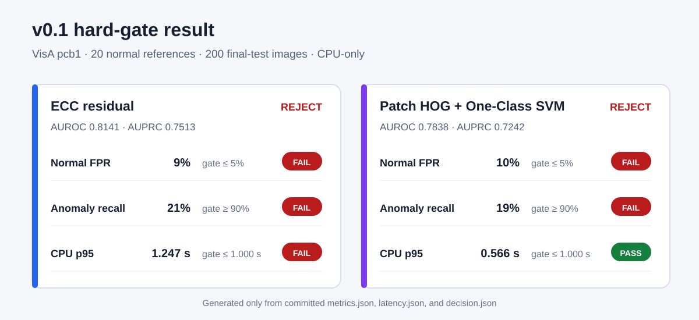

# Few-Shot Anomaly PoC

## 日本語概要

このリポジトリは、正常画像20枚以内・CPU実行・異常ラベルを学習に使わない条件で、少数例の外観異常検知が次段階の検証に値するかを判定した公開技術検証です。

ECCによる位置合わせ残差法と、局所勾配特徴量を用いた一クラス分類法を、事前に固定した誤検知率・再現率・処理時間の基準で比較しました。両手法とも採用基準を満たさず、却下という結果をそのまま公開しています。

正常データだけによる閾値校正、一度だけの最終評価、誤検知・見逃し一覧、処理時間、判定根拠、チェックサム付き成果物を保存しています。再現手順、評価値、制約の詳細は以下の英語本文を参照してください。

v0.2ではDINOv2 sourceと標準ViT-S/14 checkpointをGit管理外へ取得し、SHA-256、archive安全性、checkpoint構造、license境界を非実行で確認しました。deserialize、tensor検査、model構築、推論、性能評価は未実施です。

---

A preregistered CPU-only evaluation that turns two normal-only visual anomaly methods into an auditable go/no-go decision.

This is a source-available, noncommercially licensed public portfolio project.

> **Status: v0.1 complete — `REJECT`**
>
> Neither method passed every fixed operating-point gate. The thresholds and gates were not revised after the result.

> **v0.2 status: controlled model-asset acquisition complete — `PROCEED TO WEIGHTS-ONLY STRICT LOAD VERIFICATION`**
>
> The fixed source archive and standard `dinov2_vits14` checkpoint were acquired into an ignored external cache. Both have observed SHA-256 identities and passed non-executing container checks. Neither upstream asset publishes an independent SHA-256, so both identities remain `observed_only`. No checkpoint deserialization, model construction, tensor operation, inference, or performance result is present. See the [controlled model-asset acquisition record](docs/v0.2-model-asset-acquisition.md).

## Representative Result



| Method | AUROC | Normal FPR | Anomaly recall | CPU p95 | Decision |
| --- | ---: | ---: | ---: | ---: | --- |
| ECC residual | `0.8141` | `0.09` | `0.21` | `1.2470 s` | `REJECT` |
| Patch HOG + One-Class SVM | `0.7838` | `0.10` | `0.19` | `0.5658 s` | `REJECT` |

AUROC describes ranking, but it was not an acceptance gate. The fixed operating points missed the required normal FPR of at most `0.05` and anomaly recall of at least `0.90`.

## Quick Start

The locked environment requires CPython `3.13.14` and uv `0.11.32`.

```bash
git clone https://github.com/cab0a/few-shot-anomaly-poc.git
cd few-shot-anomaly-poc
uv sync --locked
uv run --locked --no-sync python scripts/verify_environment.py
quick_start_root="$(mktemp -d)"
uv run --locked --no-sync python scripts/run_synthetic_evaluation.py \
  --output-root "${quick_start_root}"
```

The last command writes a deterministic `synthetic-e2e/` JSON/CSV bundle under the printed temporary path. It checks the evaluation pipeline and artifact contract without downloading VisA; it is not method-performance evidence.

Regenerate the representative figure from the committed final numeric artifacts:

```bash
uv run --locked --no-sync python scripts/render_v0_1_summary.py
```

## Generated Artifacts

| Evidence | Location | What it preserves |
| --- | --- | --- |
| v0.2 model-asset acquisition | [`artifacts/v0.2/model-assets/acquisition.json`](artifacts/v0.2/model-assets/acquisition.json) | Source and checkpoint transport metadata, observed hashes, archive and pickle structure, license separation, and the non-execution boundary |
| v0.2 import smoke | [`artifacts/v0.2/environment/import-smoke.json`](artifacts/v0.2/environment/import-smoke.json) | Exact installed versions, isolated import origins, CPU-only PyTorch identity, non-execution boundary, and the next-step decision |
| v0.2 wheel inspection | [`artifacts/v0.2/dependencies/wheel-inspection.json`](artifacts/v0.2/dependencies/wheel-inspection.json) | Locked URLs and hashes, safe-ZIP and RECORD checks, internal license material, native files, and the isolated-install decision |
| Final evaluation bundle | [`artifacts/v0.1/evaluation/visa-pcb1-v0-1-final/`](artifacts/v0.1/evaluation/visa-pcb1-v0-1-final/) | Per-image scores and classifications, revealed labels, metrics, latency observations, selected errors, decisions, and a SHA-256 manifest |
| Normal-only calibration | [`artifacts/v0.1/calibration/normal-only/`](artifacts/v0.1/calibration/normal-only/) | Fixed thresholds, fitted-state identities, and calibration evidence |
| Label-free final scoring | [`artifacts/v0.1/scoring/first-fixed-final-test/`](artifacts/v0.1/scoring/first-fixed-final-test/) | Scores, classifications, and latency recorded before class reveal |
| Evaluation freeze | [`artifacts/v0.1/freeze/pre-evaluation-freeze.json`](artifacts/v0.1/freeze/pre-evaluation-freeze.json) | Source, configuration, partitions, rules, and file identities fixed before final scoring |
| Synthetic fixture | [`artifacts/v0.1/evaluation/synthetic-e2e/`](artifacts/v0.1/evaluation/synthetic-e2e/) | Byte-reproducible integration evidence made only from generated records |
| Numeric result figure | [`docs/assets/v0.1-gate-summary.svg`](docs/assets/v0.1-gate-summary.svg) | Gate outcomes rendered from committed JSON, without source or derived dataset pixels |

## Overview

This public case study asks whether either of two deliberately small visual anomaly methods justifies a follow-up prototype under a constrained, hypothetical inspection scenario:

- fit from no more than 20 normal reference images;
- use no anomalous training labels;
- score on a general CPU;
- calibrate the operating threshold from normal images only; and
- preserve enough evidence to reconstruct the decision.

The repository covers the full path from requirements and method selection through implementation, evaluation, error selection, and a negative decision. It does not represent a customer engagement, private dataset, production requirement, or deployed inspection system.

## Key Features

- Requirements, methods, metrics, latency boundary, gates, and decision order were written before final-test scoring.
- Reference fitting and threshold calibration use normal data only.
- Per-image scoring and classification were preserved before final-test labels entered the evaluation boundary.
- Both favorable and unfavorable results remain committed; failed gates cannot be waived by an aggregate score.
- JSON and CSV contracts fix required fields, ordering, finite-number rules, relative paths, and non-overwrite behavior.
- The final manifest records artifact counts, source and configuration identities, and SHA-256 values.
- Tests cover deterministic primitives, leakage boundaries, frozen identities, exact committed metrics, gate order, and byte reproduction.

## Technical Design

The two methods share deterministic grayscale conversion and direct `512 × 512` area-interpolation resizing:

1. **ECC residual:** align each image to a normal template with bounded Euclidean ECC registration, compute a normalized residual, and aggregate the largest residual values into one image score.
2. **Patch HOG + One-Class SVM:** extract fixed-position HOG patches, fit one reference-derived scaler and One-Class SVM per position, and aggregate the most anomalous patch scores.

Both methods use a nearest-rank 95th percentile of 884 normal calibration scores as the fixed threshold. Scoring failures map to positive infinity, so a failed decode or method operation cannot silently appear normal.

Implementation details and stable failure codes are kept in the [method specification](docs/method-specification.md). The machine-readable artifact contract is defined by [`schemas/v0.1/evaluation-artifacts.json`](schemas/v0.1/evaluation-artifacts.json) and explained in the [artifact schema guide](docs/evaluation-artifact-schema.md).

## Evaluation Methodology

### Fixed data boundary

v0.1 uses the official VisA `pcb1` one-class split.

| Partition | Purpose | Count | Label boundary |
| --- | --- | ---: | --- |
| Normal reference | Fit both methods | 20 | Normal status only |
| Normal calibration | Fix one threshold per method | 884 | Normal status only |
| Final test | One fixed scoring and decision run | 200: 100 normal, 100 anomaly | Classes joined only during evaluation |

Seed `42` and a version-independent SHA-256 path-ranking rule fixed the reference IDs. The three path sets were checked for overlap. Raw images, masks, and local fitted state remain outside Git.

### Preregistered hard gates

A method could pass only if every gate passed, in this order:

| Order | Gate | Pass condition |
| ---: | --- | --- |
| 1 | Final-test normal FPR | `<= 0.05` |
| 2 | Final-test anomaly recall | `>= 0.90` |
| 3 | CPU p95 scoring latency | `<= 1.0 s/image` |
| 4 | Normal reference count | `<= 20` |
| 5 | Anomaly training labels | None used |
| 6 | Reproducibility | Verified |

AUROC and AUPRC were descriptive ranking metrics. They could not override a failed gate. The complete protocol, measurement rules, and change control are in the [evaluation plan](docs/evaluation-plan.md) and [pre-evaluation freeze](docs/pre-evaluation-freeze.md).

## Results

Both methods scored all 200 final-test images without a score-generation failure.

| Method | AUPRC | FP | FN | CPU median | Passed performance gates |
| --- | ---: | ---: | ---: | ---: | --- |
| ECC residual | `0.7513` | 9 | 79 | `0.4370 s` | 0 of 3 |
| Patch HOG + One-Class SVM | `0.7242` | 10 | 81 | `0.4327 s` | 1 of 3 |

The normal-only calibration FPR was approximately `4.98%` for both methods, but final-test normal FPR rose to `9%` and `10%`. At those fixed thresholds, anomaly recall was only `21%` and `19%`. This supports the `REJECT` decision under the stated gates; it does not identify the cause of the transfer gap.

For each method, the evaluator mechanically selected the five highest-scoring false positives and five lowest-scoring false negatives. Image content was not reviewed, so the repository does not claim that alignment, illumination, layout, defect size, or another visual factor caused those errors.

During the final run, the CLI atomically wrote and validated the complete bundle, then failed while printing a summary because it expected outdated key names. The bundle was retained, the printing defect was corrected after boundary review, and final scoring was not rerun. The sequence is recorded in [Final Evaluation and Decision](docs/final-evaluation-and-decision.md).

See the [public evaluation report](docs/v0.1-evaluation-report.md) for thresholds, confusion counts, gate outcomes, interpretation, and evidence links.

## Limitations

- Only one dataset category, one official split, one seed, and one 20-image reference set were evaluated.
- No confidence interval, repeated-reference-set analysis, or statistical-significance claim is provided.
- VisA paths contain class-semantic directory names. The scorer did not receive a class field or branch on class, but this is not a double-blind protocol.
- CPU latency is specific to the recorded hardware, software environment, and decoded-grayscale-to-score boundary.
- Selected failure records were not followed by an image-content review, so no causal error taxonomy is claimed.
- Image-level metrics do not measure anomaly localization.
- Synthetic evaluation artifacts test pipeline behavior, not VisA performance.
- Results do not generalize to other VisA categories, production cameras, processes, or defect distributions.

## Reproducibility

Clone-only verification checks the committed source, lock, synthetic fixture, freeze, and final numerical evidence:

```bash
uv sync --locked
uv run --locked --no-sync python scripts/verify_environment.py
uv run --locked --no-sync ruff check .
uv run --locked --no-sync pytest
uv run --locked --no-sync python scripts/render_v0_1_summary.py
git diff --exit-code -- docs/assets/v0.1-gate-summary.svg
```

A complete image-level rerun additionally requires the official `VisA_20220922.tar`, pinned split revision, local storage, and clean checkouts of the recorded stage commits. Each runner refuses to overwrite an existing output. Follow the [data preparation guide](data/README.md), [acquisition record](docs/data-acquisition-record.md), [calibration record](docs/normal-only-calibration.md), [scoring record](docs/first-fixed-final-test-scoring.md), and [final evaluation record](docs/final-evaluation-and-decision.md).

The committed metrics can be reconstructed from preserved scoring evidence. A second raw-image scoring run was not performed, and latency is not expected to reproduce byte-for-byte on different hardware.

## Development and Testing

```bash
uv sync --locked
uv run --locked --no-sync ruff check .
uv run --locked --no-sync pytest
```

GitHub Actions runs the same locked lint and test commands on Ubuntu 24.04 with CPython `3.13.14`. It also executes the README Quick Start, checks the synthetic manifest and per-method metrics, regenerates the representative SVG, and requires an empty figure diff.

A separate shared workflow checks every Markdown file for the Japanese and English summary contract, local links, encoding problems, merge markers, machine-specific paths, and README structure.

## Compatibility

- **Python:** exactly CPython `3.13.14`
- **Environment manager:** exactly uv `0.11.32`
- **Recorded execution environment:** Ubuntu 24.04 on WSL2, x86-64
- **Evaluation boundary:** decoded grayscale `uint8` input through image score; file I/O and one-time fitting are excluded from latency

Other Python, operating-system, CPU, or dependency combinations are not claimed as supported.

## License

Original code and documentation are source-available under the PolyForm Noncommercial License 1.0.0. This public portfolio repository is not offered for commercial reuse under those terms. Commercial licensing may be available through a separate written agreement.

VisA is not included in the repository and remains separately licensed under CC BY 4.0. The numeric SVG contains no VisA image pixels. DINOv2 source and checkpoint bytes are also excluded from Git and remain separately governed by their upstream terms. Third-party dependencies remain governed by their respective licenses.

See [`LICENSE`](LICENSE) for the controlling terms. See [`NOTICE.md`](NOTICE.md), [Runtime Dependencies and License Boundaries](docs/dependencies-and-licenses.md), the [v0.2 Preliminary License Inventory](docs/v0.2-dependencies-and-licenses.md), the [v0.2 Internal License Inspection](docs/v0.2-dependency-artifact-inspection.md), and the [v0.2 Model-Asset Acquisition Record](docs/v0.2-model-asset-acquisition.md) for separate rights and attribution.

## Documentation

| Document | Scope |
| --- | --- |
| [Problem and Requirements](docs/problem-and-requirements.md) | Hypothetical case, acceptance gates, risks, and non-goals |
| [Research and Method Selection](docs/research-and-method-selection.md) | Longlist, shortlist, deferrals, and sources |
| [DINOv2 Adoption Research](docs/dinov2-adoption-research.md) | Evidence, risks, conditions, and the bounded v0.2 research decision |
| [v0.2 Preflight Preregistration](docs/v0.2-preflight-preregistration.md) | Fixed model, environment, CPU protocol, asset checks, stop rules, and untouched boundary |
| [v0.2 Model and Dependency Metadata](docs/v0.2-model-and-dependency-metadata.md) | Official URLs, HTTP metadata, published hashes, license expressions, and acquisition controls |
| [v0.2 Dependency Lock and Preliminary License Inventory](docs/v0.2-dependencies-and-licenses.md) | Isolated lock, exact transitive resolution, published hashes, license evidence, and the next acquisition boundary |
| [v0.2 Dependency Artifact and Internal License Inspection](docs/v0.2-dependency-artifact-inspection.md) | Whole-wheel and RECORD verification, bundled license evidence, native-file inventory, and the isolated-install decision |
| [v0.2 Isolated Installation and Import Smoke](docs/v0.2-isolated-installation-and-import-smoke.md) | Offline exact-wheel installation, import origins, CPU-only PyTorch evidence, stopped sync attempt, and the next-step boundary |
| [v0.2 Controlled Model-Asset Acquisition](docs/v0.2-model-asset-acquisition.md) | Fixed source and checkpoint hashes, safe container inspection, license separation, stopped attempts, and the strict-load boundary |
| [Method Specification](docs/method-specification.md) | Fixed preprocessing, parameters, scoring, and failure rules |
| [Evaluation Plan](docs/evaluation-plan.md) | Partitions, metrics, latency, error selection, and decision logic |
| [Evaluation Artifact Schema](docs/evaluation-artifact-schema.md) | JSON/CSV contract, deterministic serialization, and integrity |
| [Public Evaluation Report](docs/v0.1-evaluation-report.md) | Results, interpretation, limitations, and recommended next study |
| [Completion Review](docs/v0.1-completion-review.md) | Release evidence, reproduction boundary, content audit, and claim review |
