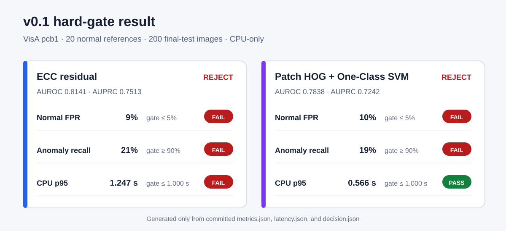

# Few-Shot Anomaly PoC

## 日本語概要

このリポジトリは、正常画像20枚・CPU・異常学習ラベルなしで、外観異常検知を次工程へ進めるか判定する公開PoCです。

v0.1はECC残差法とPatch HOG + One-Class SVM、v0.2はDINOv2 224を加えた3方式を比較しました。opaque IDによるlabel-free scoring、offline reproduction、1回限りのlabel reveal、定量評価、順序付きhard gateを完了し、全方式とプロジェクトを`REJECT`としました。

v0.3.3では、reviewer入力をopaque ID・read-only pixels・固定formだけに限定するprimitiveを実装し、28件のsynthetic画像で検証しました。VisA画像閲覧・score実行・実観察はまだ行っていません。詳細は英語本文を参照してください。

---

A preregistered CPU-only evaluation that turns normal-only visual anomaly methods into an auditable go/no-go decision.

This is a source-available, noncommercially licensed public portfolio project.

> **Status: v0.2 complete — `REJECT`**
>
> ECC residual and Patch HOG + One-Class SVM failed the fixed anomaly-recall gate. DINOv2 224 failed the earlier normal-FPR gate. All method decisions and the project decision are `REJECT`; no method is selected. See the [v0.2 evaluation report](docs/v0.2-evaluation-report.md) and [completion review](docs/v0.2-completion-review.md).

> **v0.3.3 status: blinded review primitive synthetically verified; real review not started**
>
> The positive-allowlist reviewer interface passed 18 checks with 28 temporary synthetic images. No VisA image was accessed, no real observation was written, no anomaly scorer ran, and the completed v0.2 final test remains closed. See the [v0.3.0 preregistration](docs/v0.3-development-diagnostic-preregistration.md), [v0.3.1 contract record](docs/v0.3.1-machine-readable-diagnostic-contract.md), [v0.3.2 inventory record](docs/v0.3.2-no-image-inventory-and-pre-access-checkpoint.md), and [v0.3.3 verification record](docs/v0.3.3-blinded-review-primitive-and-synthetic-verification.md).

## Representative Result

| Method | AUROC | AUPRC | Normal FPR | Anomaly recall | CPU p95 | Decision |
| --- | ---: | ---: | ---: | ---: | ---: | --- |
| ECC residual | `0.6640` | `0.6258` | `0.04` | `0.13` | `0.6639 s` | `REJECT` |
| Patch HOG + One-Class SVM | `0.7147` | `0.6983` | `0.05` | `0.16` | `0.5450 s` | `REJECT` |
| DINOv2 ViT-S/14 224 NN | `0.7943` | `0.7572` | `0.07` | `0.34` | `0.4611 s` | `REJECT` |

AUROC and AUPRC describe ranking; neither can override a failed operating-point gate. The fixed procedure stopped at the first failure, so latency and later process gates were not evaluated as decision gates even though their evidence remains public.

### v0.1 baseline result



The earlier `pcb1` baseline also ended in `REJECT` for both classical methods. Its separate thresholds, metrics, and decisions remain in the [v0.1 public report](docs/v0.1-evaluation-report.md).

## Quick Start

The locked environment requires CPython `3.13.14` and uv `0.11.32`.

```bash
git clone https://github.com/cab0a/few-shot-anomaly-poc.git
cd few-shot-anomaly-poc
uv sync --locked
uv run --locked --no-sync python scripts/verify_environment.py
quick_start_root="$(mktemp -d)"
uv run --locked --no-sync python scripts/run_synthetic_evaluation.py \
  --output-root "${quick_start_root}"
```

The last command writes a deterministic `synthetic-e2e/` JSON/CSV bundle under the printed temporary path. It checks the evaluation pipeline and artifact contract without downloading VisA; it is not method-performance evidence.

Regenerate the representative figure from the committed final numeric artifacts:

```bash
uv run --locked --no-sync python scripts/render_v0_1_summary.py
```

## Generated Artifacts

| Evidence | Location | What it preserves |
| --- | --- | --- |
| v0.3.3 synthetic blinded-review verification | [`artifacts/v0.3/synthetic/blinded-review-verification.json`](artifacts/v0.3/synthetic/blinded-review-verification.json) | 18 passing interface, ordering, immutable-pixel, metadata-exclusion, deterministic-serialization, completion-checkpoint, and rejection checks with explicit no-VisA/no-scorer boundaries |
| v0.3.2 no-image inventory and pre-access checkpoint | [`artifacts/v0.3/diagnostics/pcb2-development/`](artifacts/v0.3/diagnostics/pcb2-development/) | Exact 28 opaque review identities, separate 29-row later linkage, deterministic 60-normal development partition, parent hashes, and explicit zero v0.3 image-access/scoring state |
| v0.2.8 decisions and complete manifest | [`artifacts/v0.2/evaluation/visa-pcb2-v0-2-final/`](artifacts/v0.2/evaluation/visa-pcb2-v0-2-final/) | Three ordered method decisions, all-reject project decision, no selected method, one next validation, and a 35-entry SHA-256 manifest |
| v0.2.7 label reveal, metrics, and failure cases | [`artifacts/v0.2/evaluation/visa-pcb2-v0-2-final/`](artifacts/v0.2/evaluation/visa-pcb2-v0-2-final/) | Exact 200-ID label join, three method metrics, confusion counts, zero score-failure evidence, deterministic FP/FN selections, and the stage-local no-decision/no-image-access boundary |
| v0.2.6 offline reproduction and pre-reveal checkpoint | [`artifacts/v0.2/evaluation/visa-pcb2-v0-2-final/`](artifacts/v0.2/evaluation/visa-pcb2-v0-2-final/) | Three first-ten offline reproduction files, exact score/status/failure comparisons, pushed label-free evidence commit, 23-file bundle identity, and the closed label boundary |
| v0.2.5 label-free final-test scoring and CPU latency | [`artifacts/v0.2/evaluation/visa-pcb2-v0-2-final/`](artifacts/v0.2/evaluation/visa-pcb2-v0-2-final/) | Three per-method label-free bundles with 200 canonical scores, 200 fixed-threshold classifications, 600 CPU observations, exact repeated-score evidence, and an unrevealed label boundary |
| v0.2.4 reference fitting and normal-only calibration | [`artifacts/v0.2/evaluation/visa-pcb2-v0-2-final/`](artifacts/v0.2/evaluation/visa-pcb2-v0-2-final/) | Per-method fit status and external state identity, all 881 normal-calibration scores, fixed thresholds, realized calibration FPR, zero-failure evidence, and an unrevealed final-test boundary |
| v0.2.3 pre-evaluation freeze | [`artifacts/v0.2/evaluation/visa-pcb2-v0-2-final/freeze/`](artifacts/v0.2/evaluation/visa-pcb2-v0-2-final/freeze/) | Pushed source, exact config and schema, normal partition identities, opaque final-test identities, method order, hard-gate order, and the unrevealed-label assertion fixed before fitting |
| v0.2.2 boundary record | [`artifacts/v0.2/evaluation/visa-pcb2-v0-2-final/boundary/`](artifacts/v0.2/evaluation/visa-pcb2-v0-2-final/boundary/) | Fixed archive, split, partition counts, opaque scoring-manifest identity, sealed-mapping identity, and explicit no-class-count/no-raw-data assertions |
| v0.2.0 final preflight decision | [`artifacts/v0.2/preflight/final-decision/`](artifacts/v0.2/preflight/final-decision/) | Synthetic opaque-boundary feasibility, untouched-data flags, exact evidence identities, ordered conditions 1–10, and the scoped `PROCEED` decision |
| v0.2 first fixed offline score reproduction | [`artifacts/v0.2/offline-reproduction/first-fixed-run/`](artifacts/v0.2/offline-reproduction/first-fixed-run/) | Regenerated input identities, ten exact score comparisons, fixed asset and configuration identities, fresh-worker validation, boundary, and condition-9 result |
| v0.2 first fixed memory-bounded CPU timing | [`artifacts/v0.2/cpu-timing/first-fixed-memory-bounded-run/`](artifacts/v0.2/cpu-timing/first-fixed-memory-bounded-run/) | Fixed synthetic input identities, 600 per-invocation observations, independently checked median and p95, peak RSS, both resolution outcomes, and the untouched dataset boundary |
| v0.2 memory-bounded precondition pass | [`artifacts/v0.2/cpu-preflight/attempt-002-memory-bounded-pass.json`](artifacts/v0.2/cpu-preflight/attempt-002-memory-bounded-pass.json) | New preregistration identity, unchanged CPU boundary, non-gating memory diagnostics, zero-timing boundary, and authorization to implement the runner |
| v0.2 CPU timing precondition stop | [`artifacts/v0.2/cpu-preflight/attempt-001-target-machine-stop.json`](artifacts/v0.2/cpu-preflight/attempt-001-target-machine-stop.json) | Ordered conditions, exact target-machine comparison, zero-timing boundary, and `DO NOT PROCEED` outcome |
| v0.2 fixed scoring-path smoke | [`artifacts/v0.2/scoring-path/synthetic-smoke.json`](artifacts/v0.2/scoring-path/synthetic-smoke.json) | Fixed preprocessing and scoring contract, real model-forward shape evidence, independent scalar-score check, synthetic-only boundary, and next-step decision |
| v0.2 weights-only strict load | [`artifacts/v0.2/model-compatibility/strict-load.json`](artifacts/v0.2/model-compatibility/strict-load.json) | Exact source origins, tensor inventory, finite-value checks, architecture identity, strict-load result, and the non-inference boundary |
| v0.2 model-asset acquisition | [`artifacts/v0.2/model-assets/acquisition.json`](artifacts/v0.2/model-assets/acquisition.json) | Source and checkpoint transport metadata, observed hashes, archive and pickle structure, license separation, and the non-execution boundary |
| v0.2 import smoke | [`artifacts/v0.2/environment/import-smoke.json`](artifacts/v0.2/environment/import-smoke.json) | Exact installed versions, isolated import origins, CPU-only PyTorch identity, non-execution boundary, and the next-step decision |
| v0.2 wheel inspection | [`artifacts/v0.2/dependencies/wheel-inspection.json`](artifacts/v0.2/dependencies/wheel-inspection.json) | Locked URLs and hashes, safe-ZIP and RECORD checks, internal license material, native files, and the isolated-install decision |
| Final evaluation bundle | [`artifacts/v0.1/evaluation/visa-pcb1-v0-1-final/`](artifacts/v0.1/evaluation/visa-pcb1-v0-1-final/) | Per-image scores and classifications, revealed labels, metrics, latency observations, selected errors, decisions, and a SHA-256 manifest |
| Normal-only calibration | [`artifacts/v0.1/calibration/normal-only/`](artifacts/v0.1/calibration/normal-only/) | Fixed thresholds, fitted-state identities, and calibration evidence |
| Label-free final scoring | [`artifacts/v0.1/scoring/first-fixed-final-test/`](artifacts/v0.1/scoring/first-fixed-final-test/) | Scores, classifications, and latency recorded before class reveal |
| Evaluation freeze | [`artifacts/v0.1/freeze/pre-evaluation-freeze.json`](artifacts/v0.1/freeze/pre-evaluation-freeze.json) | Source, configuration, partitions, rules, and file identities fixed before final scoring |
| Synthetic fixture | [`artifacts/v0.1/evaluation/synthetic-e2e/`](artifacts/v0.1/evaluation/synthetic-e2e/) | Byte-reproducible integration evidence made only from generated records |
| Numeric result figure | [`docs/assets/v0.1-gate-summary.svg`](docs/assets/v0.1-gate-summary.svg) | Gate outcomes rendered from committed JSON, without source or derived dataset pixels |

## Overview

This public case study asks whether any of three fixed normal-only visual anomaly methods justifies a follow-up prototype under a constrained, hypothetical inspection scenario:

- fit from no more than 20 normal reference images;
- use no anomalous training labels;
- score on a general CPU;
- calibrate the operating threshold from normal images only; and
- preserve enough evidence to reconstruct the decision.

The repository covers the full path from requirements and method selection through implementation, evaluation, error selection, and two completed negative decisions: the v0.1 classical baseline on `pcb1` and the v0.2 three-method comparison on `pcb2`. It does not represent a customer engagement, private dataset, production requirement, or deployed inspection system.

## Key Features

- Requirements, methods, metrics, latency boundary, gates, and decision order were written before final-test scoring.
- Reference fitting and threshold calibration use normal data only.
- Per-image scoring and classification were preserved before final-test labels entered the evaluation boundary.
- Both favorable and unfavorable results remain committed; failed gates cannot be waived by an aggregate score.
- JSON and CSV contracts fix required fields, ordering, finite-number rules, relative paths, and non-overwrite behavior.
- The v0.2 contract rejects protected final-test label fields, changed method score ranges, incomplete timing passes, inconsistent metric arithmetic, and out-of-order hard-gate traces before real boundary preparation.
- The v0.2 final manifest records all 35 other run artifacts, record counts, source and configuration identities, and SHA-256 values.
- Tests cover deterministic primitives, leakage boundaries, frozen identities, exact committed metrics, gate order, and byte reproduction.

## Technical Design

The two v0.1 methods share deterministic grayscale conversion and direct `512 × 512` area-interpolation resizing:

1. **ECC residual:** align each image to a normal template with bounded Euclidean ECC registration, compute a normalized residual, and aggregate the largest residual values into one image score.
2. **Patch HOG + One-Class SVM:** extract fixed-position HOG patches, fit one reference-derived scaler and One-Class SVM per position, and aggregate the most anomalous patch scores.

Both v0.1 methods use a nearest-rank 95th percentile of 884 normal calibration scores as the fixed threshold. Scoring failures map to positive infinity, so a failed decode or method operation cannot silently appear normal.

Implementation details and stable failure codes are kept in the [method specification](docs/method-specification.md). The v0.1 machine-readable artifact contract is defined by [`schemas/v0.1/evaluation-artifacts.json`](schemas/v0.1/evaluation-artifacts.json) and explained in the [artifact schema guide](docs/evaluation-artifact-schema.md).

The v0.2 study adds DINOv2 ViT-S/14 at `224 x 224` without changing either classical comparator. Its fixed configuration is [`configs/v0.2.yaml`](configs/v0.2.yaml), and its staged JSON/CSV evidence contract is [`schemas/v0.2/evaluation-artifacts.json`](schemas/v0.2/evaluation-artifacts.json). The [machine-readable contract record](docs/v0.2-machine-readable-evaluation-contract.md) explains exact identities, protected label-free fields, fixed finite failure scores, three-pass CPU timing, first-ten reproduction, and hard-gate ordering. The [completed boundary record](docs/v0.2-boundary-preparation.md) fixes the external normal manifests and opaque `pcb2` asset identities. Records for [v0.2.3](docs/v0.2.3-pre-evaluation-freeze.md), [v0.2.4](docs/v0.2.4-reference-fitting-and-normal-only-calibration.md), [v0.2.5](docs/v0.2.5-label-free-scoring-and-cpu-latency.md), [v0.2.6](docs/v0.2.6-offline-reproduction-and-pre-reveal-checkpoint.md), and [v0.2.7](docs/v0.2.7-label-reveal-metrics-and-failure-cases.md) preserve the freeze, normal-only fitting, label-free scoring, offline reproduction, reveal, metrics, and mechanical error selection. The [v0.2 public report](docs/v0.2-evaluation-report.md) and [completion review](docs/v0.2-completion-review.md) close the sequence with the ordered `REJECT` decisions and release audit.

The [v0.3.0 development diagnostic preregistration](docs/v0.3-development-diagnostic-preregistration.md) defines a separate, non-confirmatory study. It freezes the only final-test images that may later be viewed, first-pass metadata blinding, a 60-image controlled-normal partition rule, fixed perturbations and summaries, evidence thresholds, and invalidation conditions before any diagnostic image access or scoring. The [v0.3.1 contract record](docs/v0.3.1-machine-readable-diagnostic-contract.md), [`configs/v0.3.yaml`](configs/v0.3.yaml), and [`schemas/v0.3/diagnostic-artifacts.json`](schemas/v0.3/diagnostic-artifacts.json) encode those rules. The [v0.3.2 inventory record](docs/v0.3.2-no-image-inventory-and-pre-access-checkpoint.md) fixes the review and normal-development identities from metadata without opening image files. The [v0.3.3 verification record](docs/v0.3.3-blinded-review-primitive-and-synthetic-verification.md) proves the positive-allowlist interface and serialization behavior only against generated fixtures; real review remains pending.

## Evaluation Methodology

### Fixed v0.2 data boundary

v0.2 uses the official VisA `pcb2` one-class split.

| Partition | Purpose | Count | Label boundary |
| --- | --- | ---: | --- |
| Normal reference | Fit all three methods | 20 | Known normal only |
| Normal calibration | Fix one threshold per method | 881 | Known normal only |
| Final test | One label-free scoring run, then evaluation | 200: 100 normal, 100 anomaly | Exact opaque-ID join after score evidence was pushed |

Seed `42` and the frozen SHA-256 path-ranking rule fixed the reference IDs. Reference, calibration, and final-test records were checked for overlap and duplicates. Scorers received opaque asset IDs and no class, semantic path, split, sealed mapping, or ordering key. Raw images, masks, model assets, and fitted state remain outside Git.

### Preregistered hard gates

A method could pass only if every gate passed, in this order:

| Order | Gate | Pass condition |
| ---: | --- | --- |
| 1 | Method fit | complete fixed fitted state |
| 2 | Test leakage | none detected |
| 3 | Final-test normal FPR | `<= 0.05` |
| 4 | Final-test anomaly recall | `>= 0.90` |
| 5 | CPU p95 scoring latency | `<= 1.0 s/image` |
| 6 | Normal reference count | exactly 20 |
| 7 | Anomaly training labels | none used |
| 8 | Reproducibility | fixed first-10 offline check passes |

The procedure stops at the first failed gate. AUROC, AUPRC, later evidence, another method, and visual review cannot override that failure. The complete rules and change control are in the [v0.2 preregistration](docs/v0.2-method-and-evaluation-preregistration.md).

## Results

All three methods scored all 200 final-test images without a score-generation failure.

| Method | Normal FPR | Anomaly recall | FP | FN | CPU median | First failed gate |
| --- | ---: | ---: | ---: | ---: | ---: | --- |
| ECC residual | `0.04` | `0.13` | 4 | 87 | `0.2909 s` | anomaly recall |
| Patch HOG + One-Class SVM | `0.05` | `0.16` | 5 | 84 | `0.4241 s` | anomaly recall |
| DINOv2 ViT-S/14 224 NN | `0.07` | `0.34` | 7 | 66 | `0.3881 s` | normal FPR |

The normal-only calibration FPR was approximately `4.99%` for every method. DINOv2 provided the strongest ranking and recall, but missed 66 of 100 anomalies and exceeded the normal-FPR limit. The two classical methods met the FPR condition but detected only 13 and 16 anomalies.

The evaluator mechanically selected the highest-scoring false positives and lowest-scoring false negatives. No selected image was opened, so the repository does not claim a visual cause. Every method is `REJECT`; because all methods are rejected, the project is `REJECT` with no selected method.

See the [v0.2 public evaluation report](docs/v0.2-evaluation-report.md) for thresholds, AUPRC, confusion counts, latency boundaries, gate traces, interpretation, and evidence links.

## Limitations

- Only one v0.2 dataset category, one official split, one seed, and one 20-image reference set were evaluated.
- No confidence interval, repeated-reference-set analysis, or statistical-significance claim is provided.
- CPU latency is specific to the recorded hardware, software environments, and fixed method boundaries.
- DINOv2 timing excludes inter-process transfer, file I/O, encoded-image decoding, model loading, and fitting.
- Selected failure records were not followed by an image-content review, so no causal error taxonomy is claimed.
- Image-level metrics do not measure anomaly localization.
- Synthetic evaluation artifacts test pipeline behavior, not VisA performance.
- DINOv2 was evaluated only at 224 resolution with one frozen feature and aggregation rule.
- The revealed final test cannot be reused as an untouched tuning or confirmatory boundary.
- Results do not generalize to other VisA categories, production cameras, processes, or defect distributions.

## Reproducibility

Clone-only verification checks the committed source, lock, synthetic fixture, freeze, and final numerical evidence:

```bash
uv sync --locked
uv run --locked --no-sync python scripts/verify_environment.py
uv run --locked --no-sync ruff check .
uv run --locked --no-sync pytest
uv run --locked --no-sync python scripts/summarize_v0_2_5_label_free_scoring.py
uv run --locked --no-sync python scripts/render_v0_1_summary.py
git diff --exit-code -- docs/assets/v0.1-gate-summary.svg
```

A raw-image execution additionally requires the official `VisA_20220922.tar`, pinned split revision, local storage, fixed external manifests and fitted state, the isolated DINOv2 environment, and the recorded clean stage commits. Each runner refuses overwrite. The completed v0.2 label reveal and decision must not be rerun under the same preregistration; clone-only verification uses the committed JSON/CSV evidence. See the [v0.2 completion review](docs/v0.2-completion-review.md) and [data preparation guide](data/README.md).

The committed metrics can be reconstructed from preserved scoring evidence. A second raw-image scoring run was not performed, and latency is not expected to reproduce byte-for-byte on different hardware.

## Development and Testing

```bash
uv sync --locked
uv run --locked --no-sync ruff check .
uv run --locked --no-sync pytest
```

GitHub Actions runs the same locked lint and test commands on Ubuntu 24.04 with CPython `3.13.14`. It also executes the README Quick Start, checks the synthetic manifest and per-method metrics, regenerates the representative SVG, and requires an empty figure diff.

A separate shared workflow checks every Markdown file for the Japanese and English summary contract, local links, encoding problems, merge markers, machine-specific paths, and README structure.

## Compatibility

- **Python:** exactly CPython `3.13.14`
- **Environment manager:** exactly uv `0.11.32`
- **Recorded execution environment:** Ubuntu 24.04 on WSL2, x86-64
- **Classical latency boundary:** decoded grayscale `uint8` input through image score
- **DINOv2 latency boundary:** decoded BGR adapter plus isolated RGB-array scorer; inter-process transfer is excluded

Other Python, operating-system, CPU, or dependency combinations are not claimed as supported.

## License

Original code and documentation are source-available under the PolyForm Noncommercial License 1.0.0. This public portfolio repository is not offered for commercial reuse under those terms. Commercial licensing may be available through a separate written agreement.

VisA is not included in the repository and remains separately licensed under CC BY 4.0. The numeric SVG contains no VisA image pixels. DINOv2 source and checkpoint bytes are also excluded from Git and remain separately governed by their upstream terms. Third-party dependencies remain governed by their respective licenses.

See [`LICENSE`](LICENSE) for the controlling terms. See [`NOTICE.md`](NOTICE.md), [Runtime Dependencies and License Boundaries](docs/dependencies-and-licenses.md), the [v0.2 Preliminary License Inventory](docs/v0.2-dependencies-and-licenses.md), the [v0.2 Internal License Inspection](docs/v0.2-dependency-artifact-inspection.md), and the [v0.2 Model-Asset Acquisition Record](docs/v0.2-model-asset-acquisition.md) for separate rights and attribution.

## Documentation

| Document | Scope |
| --- | --- |
| [Problem and Requirements](docs/problem-and-requirements.md) | Hypothetical case, acceptance gates, risks, and non-goals |
| [Research and Method Selection](docs/research-and-method-selection.md) | Longlist, shortlist, deferrals, and sources |
| [DINOv2 Adoption Research](docs/dinov2-adoption-research.md) | Evidence, risks, conditions, and the bounded v0.2 research decision |
| [v0.2 Preflight Preregistration](docs/v0.2-preflight-preregistration.md) | Fixed model, environment, CPU protocol, asset checks, stop rules, and untouched boundary |
| [v0.2 Model and Dependency Metadata](docs/v0.2-model-and-dependency-metadata.md) | Official URLs, HTTP metadata, published hashes, license expressions, and acquisition controls |
| [v0.2 Dependency Lock and Preliminary License Inventory](docs/v0.2-dependencies-and-licenses.md) | Isolated lock, exact transitive resolution, published hashes, license evidence, and the next acquisition boundary |
| [v0.2 Dependency Artifact and Internal License Inspection](docs/v0.2-dependency-artifact-inspection.md) | Whole-wheel and RECORD verification, bundled license evidence, native-file inventory, and the isolated-install decision |
| [v0.2 Isolated Installation and Import Smoke](docs/v0.2-isolated-installation-and-import-smoke.md) | Offline exact-wheel installation, import origins, CPU-only PyTorch evidence, stopped sync attempt, and the next-step boundary |
| [v0.2 Controlled Model-Asset Acquisition](docs/v0.2-model-asset-acquisition.md) | Fixed source and checkpoint hashes, safe container inspection, license separation, stopped attempts, and the strict-load boundary |
| [v0.2 Weights-Only Strict Load](docs/v0.2-weights-only-strict-load.md) | Safe source extraction, complete tensor inventory, fixed architecture identity, exact strict load, and the non-inference boundary |
| [v0.2 Fixed DINOv2 Scoring Path](docs/v0.2-fixed-dinov2-scoring-path.md) | Fixed preprocessing, patch-token extraction, exact blocked scoring, implementation-smoke evidence, stopped attempts, and the formal timing boundary |
| [v0.2 CPU Timing Precondition Stop](docs/v0.2-cpu-timing-precondition-stop.md) | Ordered precondition result, exact RAM shortfall, preserved zero-timing boundary, and unchanged retry rule |
| [v0.2 Memory-Bounded CPU Preflight](docs/v0.2-memory-bounded-cpu-preflight.md) | New preflight identity, same-machine execution, sequential input storage, memory diagnostics, actual failure boundary, and unchanged latency gate |
| [v0.2 Memory-Bounded Precondition Pass](docs/v0.2-memory-bounded-precondition-pass.md) | Attempt-2 machine evidence, non-gating RAM observation, passed conditions 1–6, zero-timing boundary, and authorized next step |
| [v0.2 Memory-Bounded Timing Runner](docs/v0.2-memory-bounded-timing-runner.md) | Fixed input identities, one-image resident policy, timing loop, fresh-process orchestration, failure evidence, JSON/CSV outputs, and unexecuted formal boundary |
| [v0.2 First Fixed Memory-Bounded CPU Timing Run](docs/v0.2-first-memory-bounded-cpu-timing-run.md) | Formal 224/448 latency and peak-RSS evidence, preserved failed gate, resolution selection, boundary, and next reproduction step |
| [v0.2 Offline Score-Reproduction Runner](docs/v0.2-offline-score-reproduction-runner.md) | Fixed 224 baseline identities, fresh offline process, first-10 comparison, failure preservation, output contract, and unexecuted formal boundary |
| [v0.2 First Fixed Offline Score-Reproduction Run](docs/v0.2-first-offline-score-reproduction-run.md) | Formal first-10 comparison, exact identity matches, condition-9 pass, and the preserved boundary entering final preflight |
| [v0.2 Untouched Evaluation-Boundary Feasibility and Final Preflight Decision](docs/v0.2-final-preflight-decision.md) | Synthetic opaque-boundary checks, ordered conditions 1–10, untouched-data evidence, scoped `PROCEED` outcome, and next preregistration boundary |
| [v0.2.1 Method and Evaluation Preregistration](docs/v0.2-method-and-evaluation-preregistration.md) | Fixed `pcb2` partitions, three methods, normal-only calibration, opaque scoring and reveal, CPU timing, metrics, failure review, hard gates, artifact order, and change control |
| [v0.2.1 Machine-Readable Evaluation Contract](docs/v0.2-machine-readable-evaluation-contract.md) | Exact config and schema identities, label-free artifact boundary, standard-library validation rules, synthetic rejection tests, and the rules fixed before `pcb2` entry |
| [v0.2.2 Boundary Preparation](docs/v0.2-boundary-preparation.md) | Fixed archive and split verification, normal reference/calibration identities, opaque final-test staging, protected local layout, public boundary record, and unchanged no-score boundary |
| [v0.2.3 Pre-Evaluation Freeze](docs/v0.2.3-pre-evaluation-freeze.md) | Pushed source commit, exact contract and partition identities, method and gate order, unrevealed-label assertion, non-overwrite rule, and the next authorized stage |
| [v0.2.4 Reference Fitting and Normal-Only Calibration](docs/v0.2.4-reference-fitting-and-normal-only-calibration.md) | Fixed reference fits, all normal-calibration scores and thresholds, external state identities, execution-source note, protected boundary, and next scoring stage |
| [v0.2.5 Label-Free Final-Test Scoring and CPU Latency](docs/v0.2.5-label-free-scoring-and-cpu-latency.md) | Opaque score and classification bundles, three-pass CPU observations, repeated-score identity, label-free interpretation, fixed hashes, and the next reproduction boundary |
| [v0.2.6 Offline Reproduction and Pre-Reveal Checkpoint](docs/v0.2.6-offline-reproduction-and-pre-reveal-checkpoint.md) | Fresh-process first-ten comparisons, exact reproduction result, pushed evidence commit, 23-file bundle identity, closed reveal boundary, and next exact-ID join |
| [v0.2.7 Label Reveal, Metrics, and Failure Cases](docs/v0.2.7-label-reveal-metrics-and-failure-cases.md) | One-way exact-ID label join, image-level metrics, confusion counts, deterministic FP/FN records, fixed hashes, no-image-access boundary, and deferred decision |
| [v0.2 Public Evaluation Report](docs/v0.2-evaluation-report.md) | Three-method results, ordered gate failures, all-reject project decision, limitations, next validation, and license boundary |
| [v0.2 Completion Review](docs/v0.2-completion-review.md) | Completion criteria, decision audit, reproduction boundary, artifact and license audits, claim review, and deferred scope |
| [v0.3.0 Development-Only Diagnostic Preregistration](docs/v0.3-development-diagnostic-preregistration.md) | Fixed selected-image review boundary, blind observation fields, controlled-normal probe, diagnostic signal rule, stop conditions, and non-goals |
| [v0.2.x Milestone Map](docs/v0.2-milestone-map.md) | Parent protocol identity, milestone labels `v0.2.0`–`v0.2.8`, completion boundaries, current position, and identity-preservation rules |
| [Method Specification](docs/method-specification.md) | Fixed preprocessing, parameters, scoring, and failure rules |
| [Evaluation Plan](docs/evaluation-plan.md) | Partitions, metrics, latency, error selection, and decision logic |
| [Evaluation Artifact Schema](docs/evaluation-artifact-schema.md) | JSON/CSV contract, deterministic serialization, and integrity |
| [v0.1 Public Evaluation Report](docs/v0.1-evaluation-report.md) | Earlier `pcb1` baseline results, interpretation, limitations, and recommended next study |
| [v0.1 Completion Review](docs/v0.1-completion-review.md) | Earlier release evidence, reproduction boundary, content audit, and claim review |
